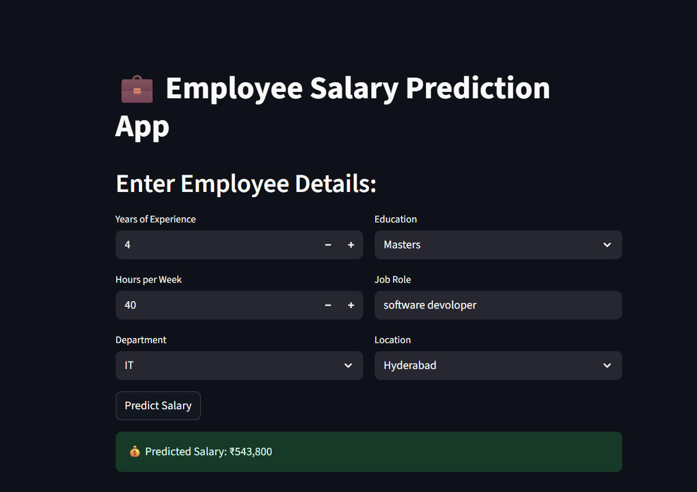

# 💼 Employee Salary Prediction using Python & Streamlit

This project predicts employee salaries based on experience, education, job role, department, working hours, and location. It uses machine learning models built in Python and provides a user-friendly interface through Streamlit.

---

## 📊 Project Overview

- **Goal**: Predict the salary of an employee using historical data  
- **Tech Stack**: Python, Pandas, scikit-learn, Streamlit  
- **Model Used**: Random Forest Regressor  
- **Interface**: Streamlit web app for live predictions

---

## 📁 Dataset

Synthetic dataset with 10 employee records:

- `YearsExperience`  
- `Education`  
- `JobRole`  
- `Department`  
- `HoursPerWeek`  
- `Location`  
- `Salary`

File: `salary_data.csv`

---

## 🧠 ML Workflow

1. Preprocessing: One-Hot Encoding + Scaling  
2. Model: Random Forest Regressor  
3. Evaluation: MSE + R² Score  
4. Model saved as: `salary_model.pkl`

---

## 🌐 Streamlit App
## 📸 Streamlit App Preview

>   
> *Figure: Salary prediction based on user input.*

Run the app locally:

```bash
streamlit run app.py

pip install pandas numpy scikit-learn streamlit joblib

---


This project is for educational purposes only.

